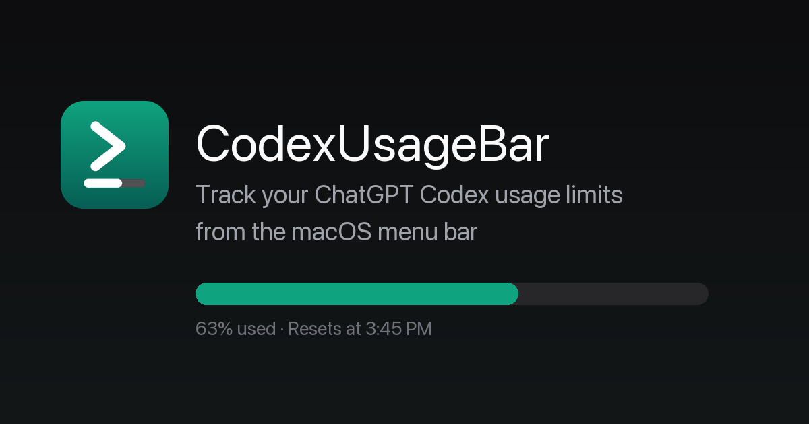

# CodexUsageBar

A minimal macOS menu bar app that tracks your **ChatGPT Codex usage limits** at a glance — session and weekly windows, per-model limits, credits, and live OpenAI service status. Never hit your Codex rate limit unexpectedly again.

**Website:** [codexusagebar.com](https://codexusagebar.com) · **Download:** [latest release](https://github.com/Artzainnn/CodexUsageBar/releases/latest/download/CodexUsageBar-Installer.dmg)



## Features

- **Usage at a glance** — your Codex limit windows (session / weekly, depending on your ChatGPT plan) in the menu bar, refreshed every 5 minutes
- **Per-model limits** — separately metered models appear automatically once you use them
- **Codex credits** — see your pay-as-you-go credit balance when you have one
- **Smart notifications** — alerts at 25/50/75/90% so you can wrap up before hitting the wall
- **Live OpenAI status** — tracks the services you pick (Codex, VS Code extension, Login…) from status.openai.com
- **Zero config** — reads your existing Codex CLI sign-in; no cookies, no API keys
- **Private by design** — talks only to OpenAI endpoints, no analytics, no middleman servers

## Install

Download the [latest DMG](https://github.com/Artzainnn/CodexUsageBar/releases/latest/download/CodexUsageBar-Installer.dmg), open it, drag CodexUsageBar to Applications. Signed and notarized.

Or with Homebrew:

```sh
brew tap Artzainnn/tap
brew install --cask codexusagebar
```

## Setup

CodexUsageBar authenticates through the official Codex CLI — it reads the sign-in that already lives on your Mac (`~/.codex/auth.json`). No cookie copying.

1. Install the Codex CLI if you don't have it: `npm i -g @openai/codex`
2. Sign in with your ChatGPT account: `codex login`
3. Launch CodexUsageBar — it picks up your sign-in automatically. If you signed in after launching, click **Re-check** in the popover.

That's it. Tokens stay on your machine; the app only calls OpenAI's own endpoints.

## Build from source

```sh
cd app
bash build.sh
```

Requires Xcode command line tools. The build script produces a universal (arm64 + x86_64) app bundle.

## License

MIT — see [LICENSE](app/LICENSE).

---

Made by [Maxime](https://x.com/buildingitmyway) · Also: [ClaudeUsageBar](https://claudeusagebar.com) for Claude usage tracking.
